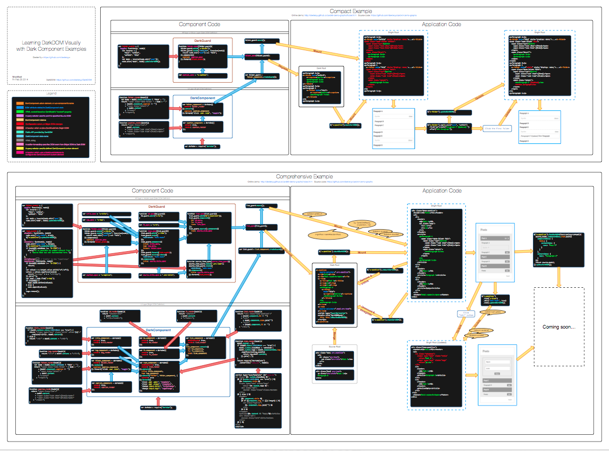

# CardKit Demo: DarkDOM

> [DarkDOM](https://github.com/dexteryy/DarkDOM)
> [CardKit](https://github.com/douban-f2e/CardKit)

## Learning DarkDOM Visually

* [PDF version](darkdom.pdf)
* [PNG version](darkdom.png)
* [Online demo (list)](http://douban-f2e.github.io/cardkit-demo-darkdom/index.html)
* [Online demo (Folder)](http://douban-f2e.github.io/cardkit-demo-darkdom/folder.html)

## Install/Update Dependencies

* `bower install -f`
