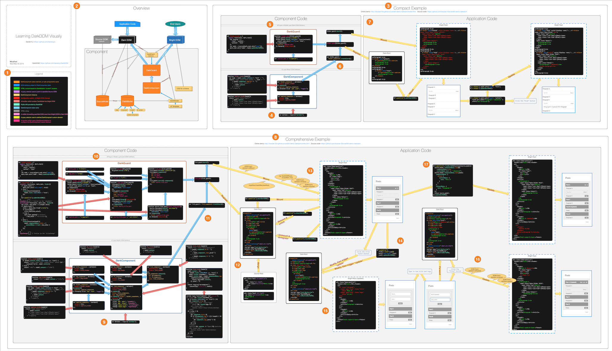

# CardKit Demo: Dark Component

> [DarkDOM](https://github.com/dexteryy/DarkDOM)

## Learning DarkDOM Visually with Dark Component Examples

[Online demo (list)](http://dexteryy.github.io/cardkit-demo-graphs/index.html)
[Online demo (Folder)](http://dexteryy.github.io/cardkit-demo-graphs/folder.html)

## Install/Update Dependencies

* `bower install -f`
